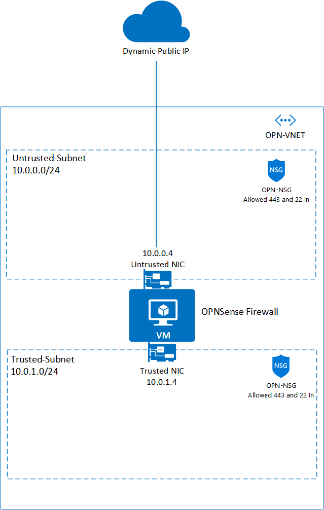

# OPNsense Firewall on FreeBSD VM

This template allows you to deploy an OPNsense Firewall VM using the opnsense-bootsrtap installation method. It creates an FreeBSD VM, does a silent install of OPNsense using a modified version of opnsense-bootstrap.sh with the settings provided.

The login credentials are set during the installation process to:

username: root
password: opnsense (lowercase)

***Please*** change default password and update the Network Security Group to remove access via public ip!

After deployment, you can go to <https://PublicIP:443> , then input the user and password, to configure the OPNsense firewall.

## Updates

Two new templates have been added to allow create OPNSense on existing VNETs. One using a Single NIC only and a second using Two NICs. Please check this link for more info: <https://github.com/dmauser/opnazure/wiki/OPNsense-on-Azure>

## Overview

This OPNSense solution is installed in FreeBSD 11.2 (Azure Image). 
Here what you will see when you deploy this Template:

1) VNET with Two Subnets and OPNSense with two NICs.
2) VNET Address space is: 10.0.0.0/16 (suggested Address space, you may change that).
3) External NIC named Untrusted Linked to Untrusted-Subnet (10.0.0.0/24).
4) Internal NIC named Trusted Linked to Trusted-Subnet (10.0.1.0/24).
5) It creates a NSG named OPN-NSG which allows incoming SSH and HTTPS. Same NSG is associated to both Subnets.

## Design

Here is a visual representation of this design:

## Deployment

Here few observations to use this solution correctly.

- When you deploy this template, it will leave only TCP 22 listening to Internet while OPNSense gets installed.
- To monitor the installation process during template deployment you can just probe the port 22 on OPNSense VM public IP (psping or tcping).
- When port is down which means OPNSense is installed and VM will get restarted automatically. At this point you will have only TCP 443.

_ **Note** :_ It will take about 10 min to complete the whole process when VM is created and a new VM CustomScript is started to install OPNSense.

## Usage

- First access can be done using <HTTPS://PublicIP.> Please ignore SSL/TLS errors and proceed.
- Your first login is going to be username "root" and password "opnsense" (PLEASE change your password right the way).
- To access SSH you can either deploy a Jumpbox VM on Trusted Subnet or create a Firewall Rule to allow SSH to Internet.
- To send traffic to OPNSense you need to create UDR 0.0.0.0 and set IP of trusted NIC (10.0.1.4) as NVA. Associate that NVA to Trusted-Subnet.

## Roadmap

The following improvements will be added soon:

1) Give an option to specify VNET Address during deployment (Completed on 04/26/2019).
2) Give an option or new template to add extra Subnets like management and DMZ.
3) Create Jumpbox automatically on Trusted Subnet or DMZ.
4) Create default UDR from Trusted to route traffic to OPNSense.

## Feedback

Please use Github [issues tab](https://github.com/dmauser/opnazure/issues) to provide feedback. Thanks!
