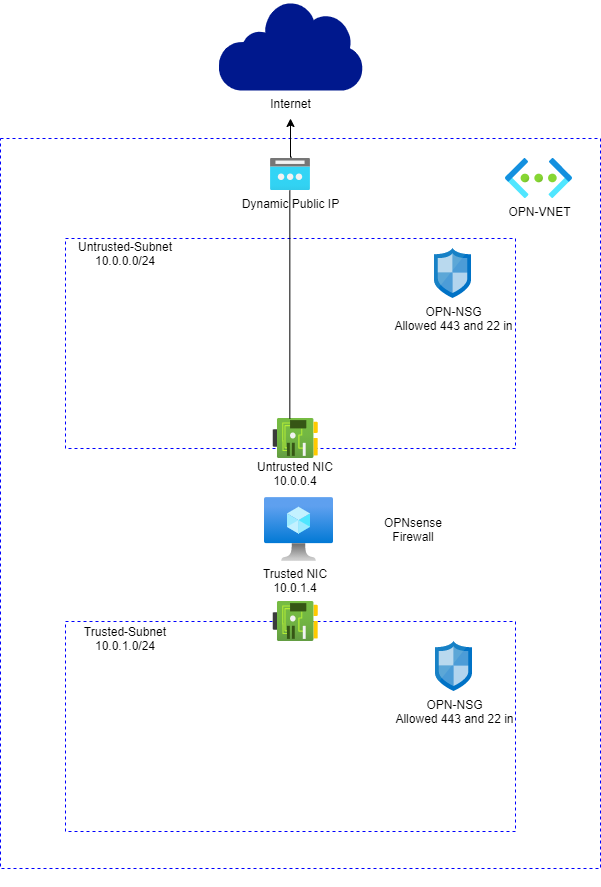
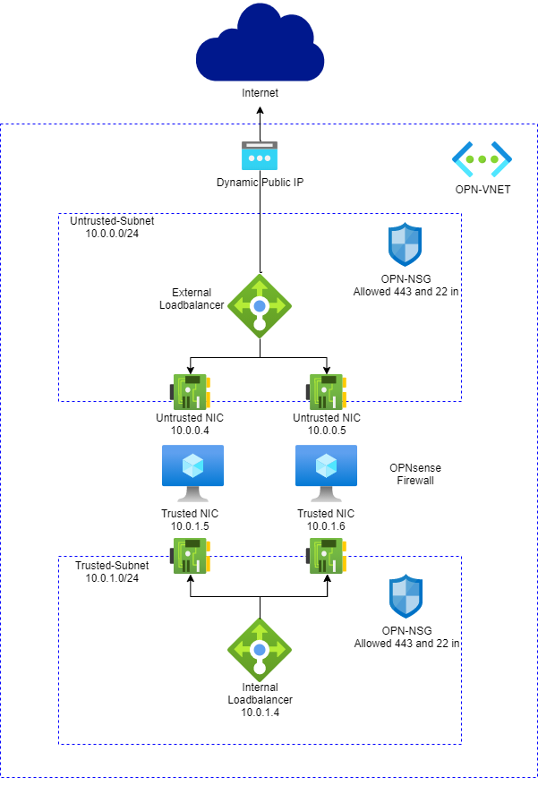

# OPNsense Firewall on FreeBSD VM

CI Name | Actions Workflow | CI Status |
|--------|--------|--------|
| BicepBuild | [bicepBuild.yml](./.github/workflows/bicepBuild.yml) |  |
| Deployment Checker | [deploymentCheker.yml](./.github/workflows/deploymentCheker.yml) |  |

**New VNET + OPNsense with two NICs (Untrusted/Trusted)**

**Existing VNET + OPNsense with two NICs (Untrusted/Trusted)**

**New VNET + OPNsense with single NIC**

**Existing VNET + OPNsense with single NIC**

**New VNET + OPNsense Active-Active (Untrusted/Trusted)**

**Existing VNET + OPNsense Active-Active (Untrusted/Trusted)**

Those template allows you to deploy an OPNsense Firewall VM using the opnsense-bootsrtap installation method. It creates an FreeBSD VM, does a silent install of OPNsense using a modified version of opnsense-bootstrap.sh with the settings provided.

The login credentials are set during the installation process to:

- Username: root
- Password: opnsense (lowercase)

*** **Please** *** Change *default password!!!*

After deployment, you can go to <https://PublicIP>, then input the user and password, to configure the OPNsense firewall.

## Updates (Nov-2021)

- Added Active-Active deployment option (using Azure Internal and External Loadbalancer and OPNsense HA settings).
- Templates are now auto-generated under the folder ARM from a Bicep template using Github Actions.

## Overview

This OPNsense solution is installed in FreeBSD 11.2 (Azure Image).
Here is what you will see when you deploy this Template:

1) VNET with Two Subnets and OPNsense VM with two NICs.
2) VNET Address space is: 10.0.0.0/16 (suggested Address space, you may change that).
3) External NIC named Untrusted Linked to Untrusted-Subnet (10.0.0.0/24).
4) Internal NIC named Trusted Linked to Trusted-Subnet (10.0.1.0/24).
5) It creates a NSG named OPN-NSG which allows incoming SSH and HTTPS. Same NSG is associated to both Subnets.
6) For Active-Active a Internal and External loadbalancer will be created.
7) Two OPNsense firewalls will be created.
8) OPNsense will be configured to allow loadbalancer probe connection.
9) OPNsense HA settings will be configured to sync rules changed between both Firewalls.

## Design

Design of two Nic deployment | Design of Active-Active deployment |
|--------|--------|
|||

## Deployment

Here are few considerations to deploy this solution correctly:

- When you deploy this template, it will leave only TCP 22 listening to Internet while OPNsense gets installed.
- To monitor the installation process during template deployment you can just probe the port 22 on OPNsense VM public IP (psping or tcping).
- When port is down which means OPNsense is installed and VM will get restarted automatically. At this point you will have only TCP 443.

**Note**: It takes about 10 min to complete the whole process when VM is created and a new VM CustomScript is started to install OPNsense.

## Usage

- First access can be done using <HTTPS://PublicIP.> Please ignore SSL/TLS errors and proceed.
- Your first login is going to be username "root" and password "opnsense" (**PLEASE change your password right the way**).
- To access SSH you can either deploy a Jumpbox VM on Trusted Subnet or create a Firewall Rule to allow SSH to Internet.
- To send traffic to OPNsense you need to create UDR 0.0.0.0 and set IP of trusted NIC IP (10.0.1.4) as next hop. Associate that NVA to Trusted-Subnet.
- **Note:** It is necessary to create appropriate Firewall rules inside OPNsense to desired traffic to work properly.

## Roadmap

The following improvements will be added soon:
- Fix waagent service not starting after OPNsense deployment

## Feedbacks

Please use Github [issues tab](https://github.com/dmauser/opnazure/issues) to provide feedback.

## Credits

Thanks for direct feedbacks and contributions from: Adam Torkar, Brian Wurzbacher, [Victor Santana](https://github.com/welasco) and Brady Sondreal.